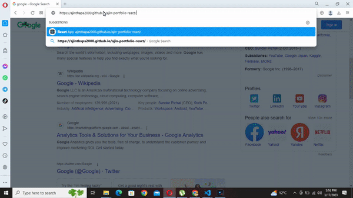

# Portfolio_React

## Discription

This is my simple portfolio react website that display the list of projects that i have published on my github along with my personal info.

## User Story

AS AN employer looking for candidates with experience building single-page applications

I WANT to view a potential employee's deployed React portfolio of work samples

SO THAT I can assess whether they're a good candidate for an open position

## Acceptance Criteria

GIVEN a single-page application portfolio for a web developer

WHEN I load the portfolio

THEN I am presented with a page containing a header, a section for content.

WHEN I view the header

THEN I am presented with the developer's name and navigation with titles corresponding to different sections of the portfolio.

WHEN I click on a navigation title

THEN I am presented with the corresponding section below the navigation without the page reloading and that title is highlighted

WHEN I load the portfolio the first time

THEN the  title  section are display by default along with my avatar.

WHEN I am presented with the project section

Then i see the list of project that i published at github that also contain small icon for git hub repo and live preview below project discription.

WHEN I am presented with the contact section.

THEN I see the form where user can send direct message to me using that form and also at footer section there is link to my github and linkedin profile.

## Project Deployed Link : https://ajinthapa2000.github.io/ajin-portfolio-react/.

## Project Animation

